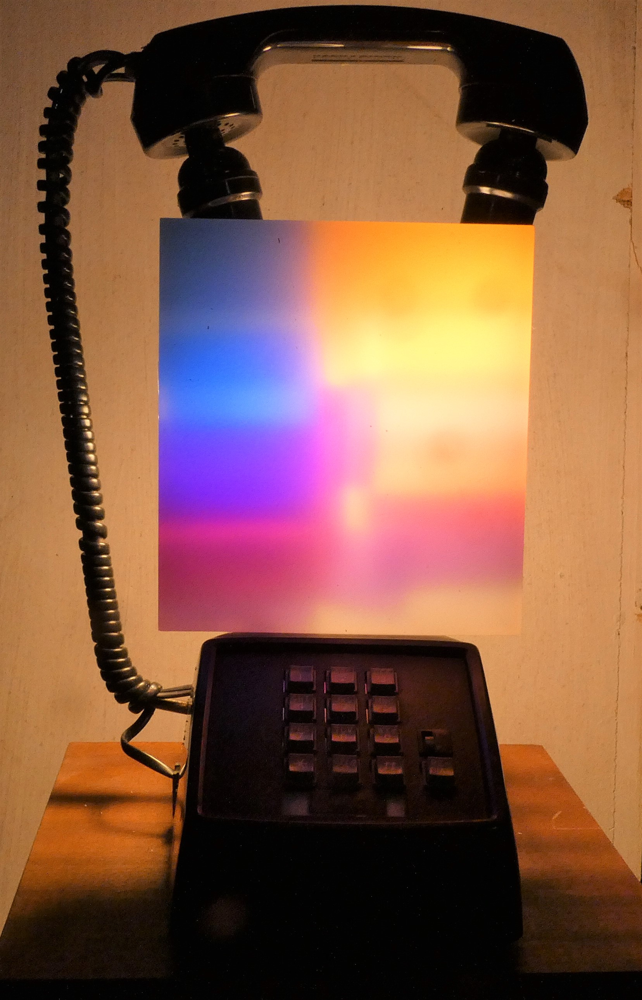
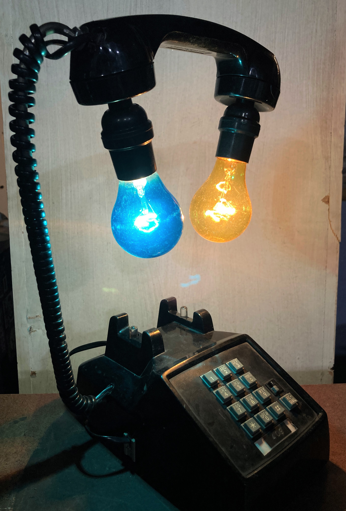
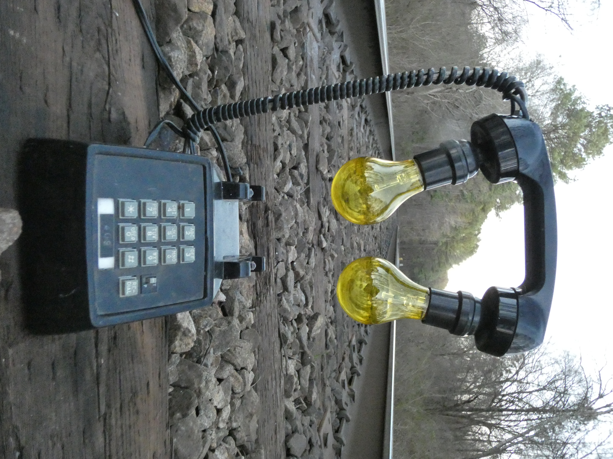

<!-- PROJECT LOGO -->
 

<h3 align="center">telephonics lamptronic</h3>

  

 a telephone lamp and a musical instrument (i guess?)
     
    <a href="https://www.instagram.com/p/Co3pO9VvTyT/">View Demo</a>
  
  

<!-- TABLE OF CONTENTS -->

  
Table of Contents

  <ol>
    <li>
      <a href="#about-the-project">About The Project</a>
    </li>
    <li>
      <a href="#getting-started">Getting Started</a>
    <li><a href="#photos">photos</a></li>
    </li>
    <li><a href="#usage">Usage</a></li>
    <li><a href="#todo">todo</a></li>
    <li><a href="#contributing">Contributing</a></li>
    <li><a href="#license">License</a></li>
    <li><a href="#contact">Contact</a></li>
    <li><a href="#acknowledgments">Acknowledgments</a></li>
  </ol>

<!-- ABOUT THE PROJECT -->
## About The Project

this is a lamp made from an old telephone. 
here is the functionality:

" 9 " key - turns on the lamp

" 1 " key - turns off the lamp

" * " (star) key - rings the ringer

"REDIAL"  - record / clear

hold redial and play a pattern with the star key. release hold and it will play it back. currently only works with staccato nots (no long presses are recorded, just the trigger)

(<a href="#readme-top">back to top</a>)

<!-- GETTING STARTED -->
## Getting Started

the final code is found in "phoneDial_recordandPlay"

the simplified version without the reocorder is "phoneDial"

<!-- USAGE EXAMPLES -->
## photos

_For more examples, please refer to the [Documentation](https://example.com)_

(<a href="#readme-top">back to top</a>)

<!-- ROADMAP -->
## TODO

- [ ] put ring function back into millis mode (dont use delay() )

- [ ] make it so the record function will hold the notes if you hold (currently it only records correctly if you play staccato

- [ ] Feature 3

(<a href="#readme-top">back to top</a>)

<!-- CONTRIBUTING -->
## Contributing

Contributions are what make the open source community such an amazing place to learn, inspire, and create. Any contributions you make are **greatly appreciated**.

If you have a suggestion that would make this better, please fork the repo and create a pull request. You can also simply open an issue with the tag "enhancement".
Don't forget to give the project a star! Thanks again!

1. Fork the Project
2. Create your Feature Branch (`git checkout -b feature/AmazingFeature`)
3. Commit your Changes (`git commit -m 'Add some AmazingFeature'`)
4. Push to the Branch (`git push origin feature/AmazingFeature`)
5. Open a Pull Request

(<a href="#readme-top">back to top</a>)

<!-- LICENSE -->
## License

Distributed under the MIT License. See `LICENSE.txt` for more information.

(<a href="#readme-top">back to top</a>)

<!-- CONTACT -->
## Contact

feel free to contact me about this project! 

(<a href="#readme-top">back to top</a>)

<!-- ACKNOWLEDGMENTS -->
## Acknowledgments

* [Peter Chu](https://github.com/PeterChu3) helped me with the keypad code and soldering and figuring things out
* [ralf schreiber's website](http://www.ralfschreiber.com/share/pulseandpatterns.html) - this is where the record and play code came from

(<a href="#readme-top">back to top</a>)

